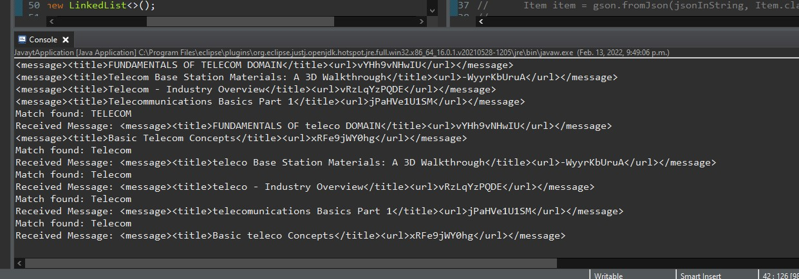

# Youtube Data API - JMS - Java

### Welcome to Youtube Data API - JMS - Java!

This project is PoC to demonstrate an asynchronous communication design with the use of YouTube Data API, JMS, and Spring Boot.

#### Functions

1. Connects to YouTube Data API
2. Retrieves metadata though search
3. Extracts specific data
4. Modification in XML format
5. Queue messages - uses queueA in memory as the broker
6. Producer publishes message to queueA - YoutubeAPI.java
7. Consumer receives message - Consumer.java
8. Modification in message uses Regex, Pattern Matcher, and replaceAll
9. Message persists in queueB

#### Design / Implementation

- Message Queue design to decouple apps and introduces asynchronous communication
- It breaks apps apart so that they operate independently from one another
- Uses producer and consumer design to send and listen for messages
- Consumer can be dedicated to one job and program can run separate operations
- Producer operates on different job, not having to wait (Ex. Message modifications)
- Enforces scalability - teams can work on different parts while other parts are functioning
- Help process data and handle heavy traffic asynchronously in its own pace
- Help testing, debugging, and experimenting with different components
- Can be used for automation and trigger for other events
- Allow future components to use different languages/framework for various expertise
- \* For demonstration purposes the fetch api is limited to 50 and 5 per page, uses in-memory queue as the broker instead of ActiveMQ

#### Technologies / Dependencies

- Java
- Spring Boot
- Spring Initializr
- JMS/ActiveMQ
- Json
- Gson
- jsonschema2pojo generator
- GitHub
- Postman (optional)

#### Compile Instruction

- Open in any Java IDE, such as Eclipse
- Run/start Java application: JavaytApplication.java

#### Instruction to Produce Result

- After the application started, it is configured to http://localhost:8081
- In Postman or browser URL enter this URL with your API {key}: http://localhost:8081/api?part=snippet&q=%22telecom%22&key={key}
- Results can be seen in the console log / cmd
- 

#### Looking Back

- I would consider experimenting with ActiveMQ as the broker and allow multiple project to run separately
- Extract more meta data and present them creatively on the frontend

### Developer: Leon Li
